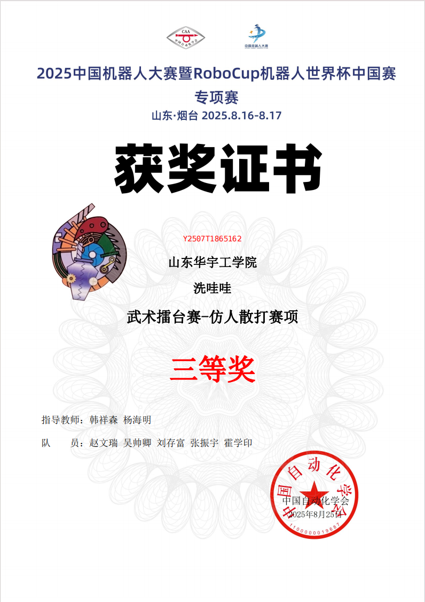
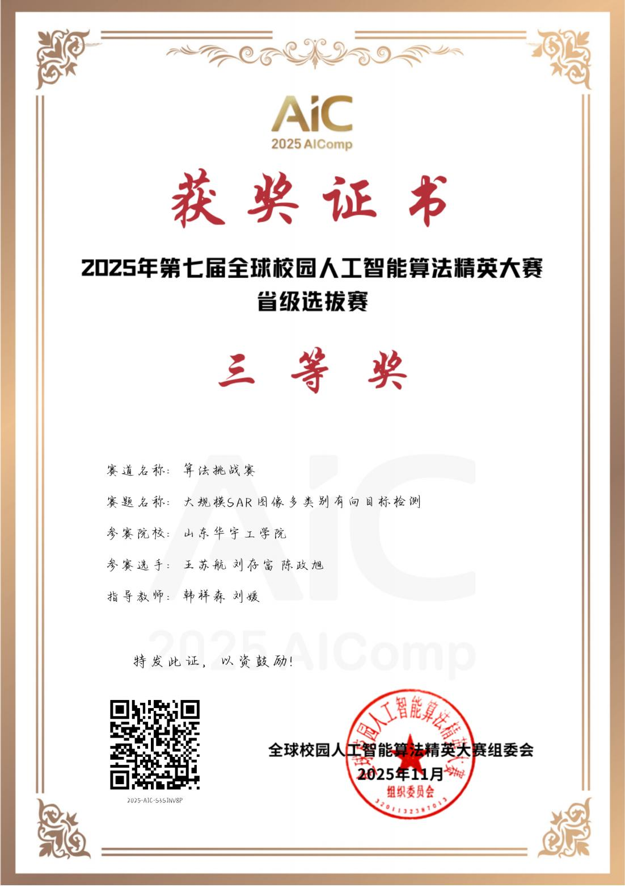
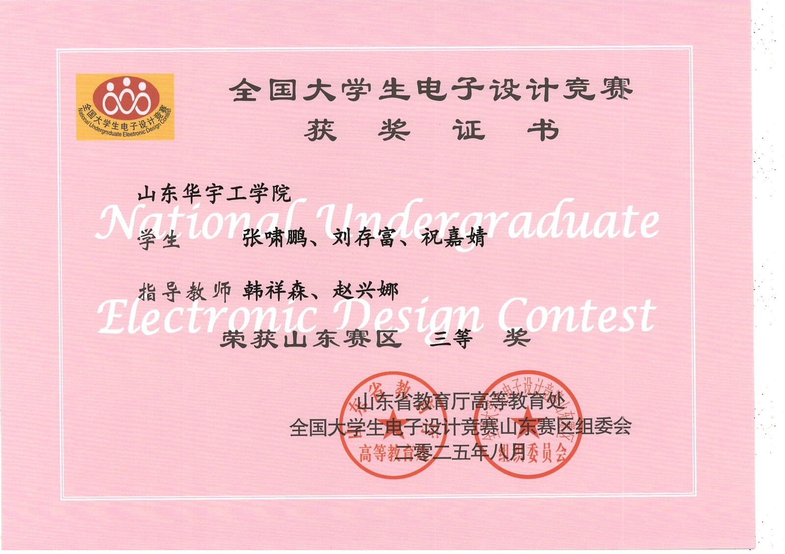
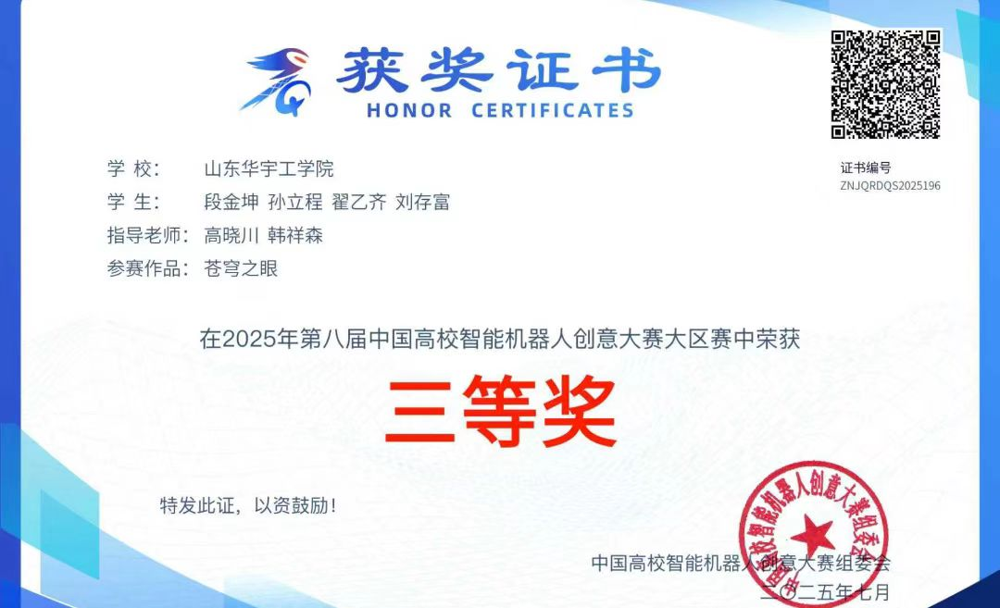
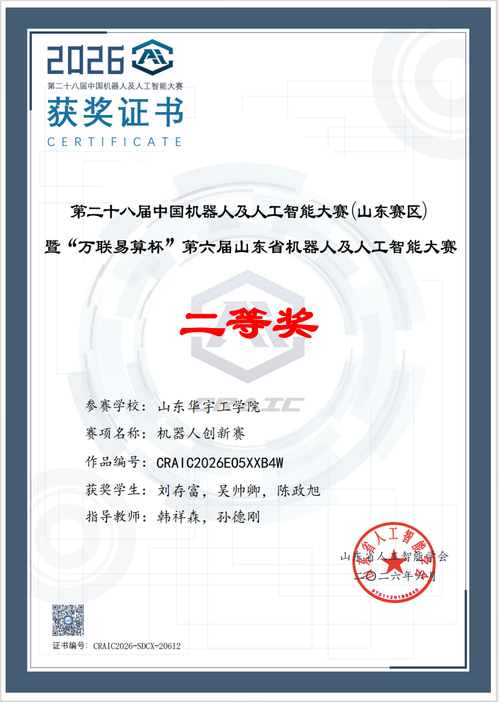
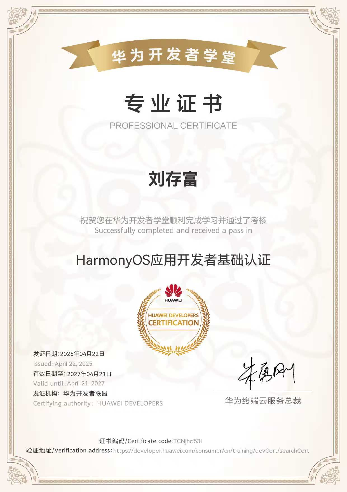
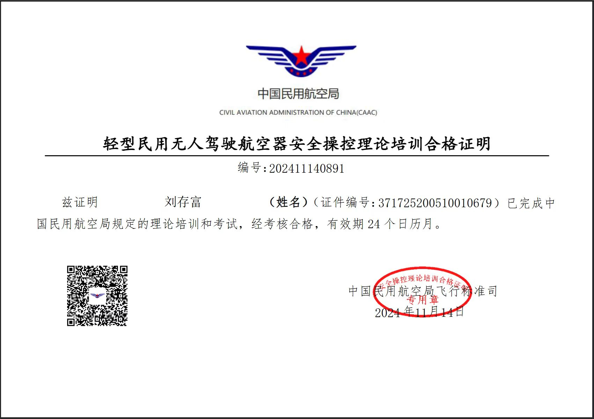
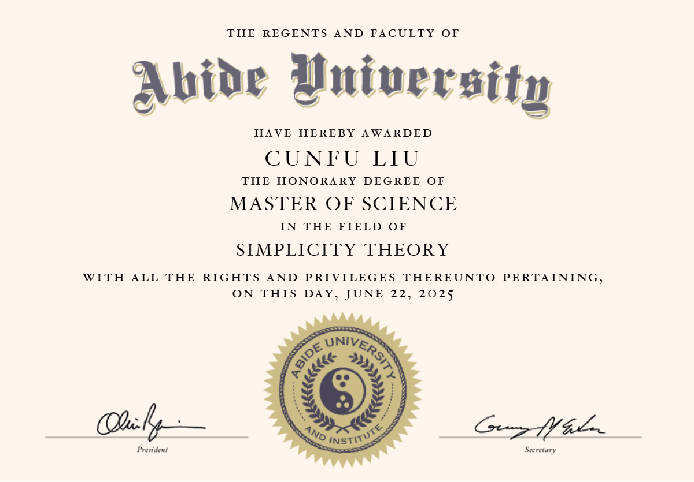

  <figure>
    
    <figcaption>2025 年 RoboCup 国赛证书</figcaption>
  </figure>
  <figure>
    
    <figcaption>2025 年 RoboCup 省赛证书</figcaption>
  </figure>
  <figure>
    
    <figcaption>2025 年人工智能算法精英赛</figcaption>
  </figure>
  <figure>
    
    <figcaption>2025 年电子设计竞赛</figcaption>
  </figure>
  <figure>
    
    <figcaption>2025 年高校创意竞赛</figcaption>
  </figure>
  <figure>
    
    <figcaption>人工智能证书</figcaption>
  </figure>
  <figure>
    
    <figcaption>华为开发者认证</figcaption>
  </figure>
  <figure>
    
    <figcaption>无人机理论考试合格证书</figcaption>
  </figure>
  <figure>
    
    <figcaption>理学硕士证书</figcaption>
  </figure>

