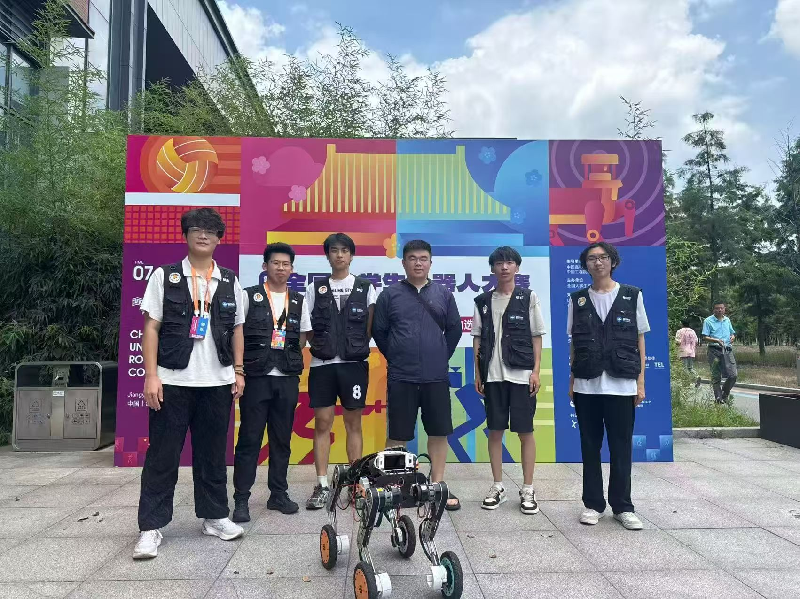
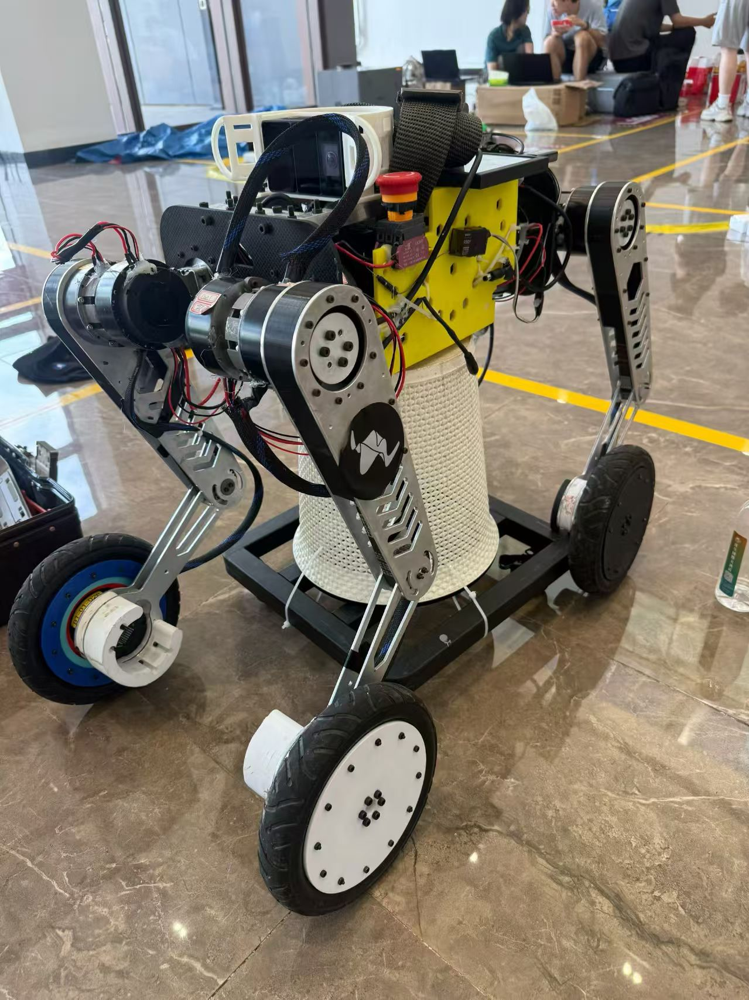
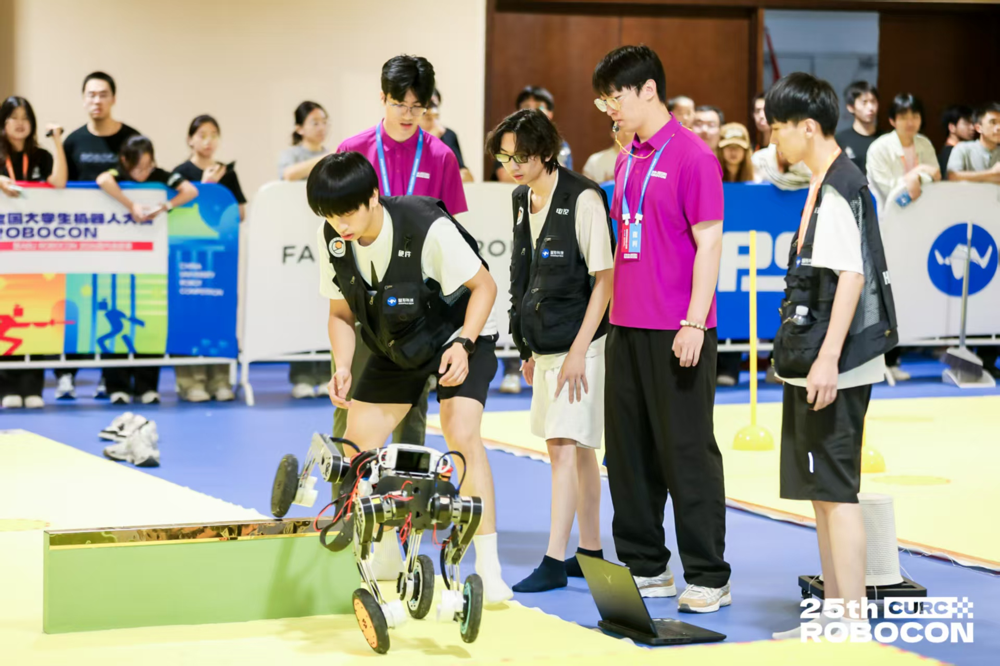
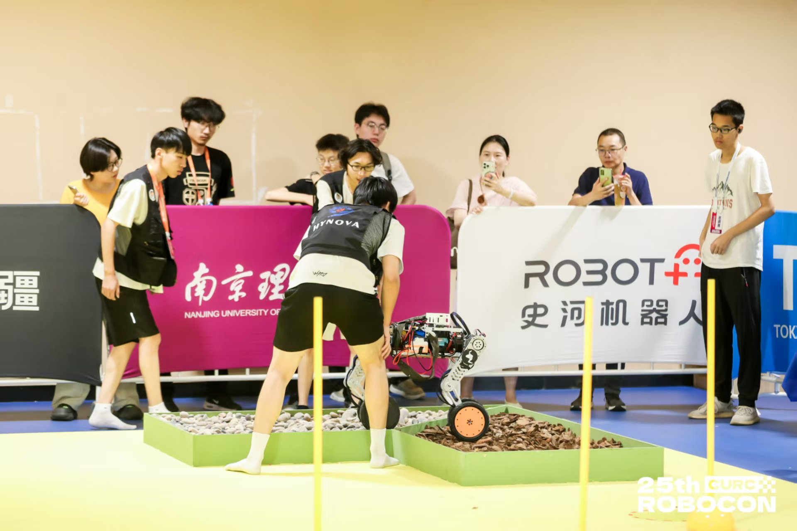
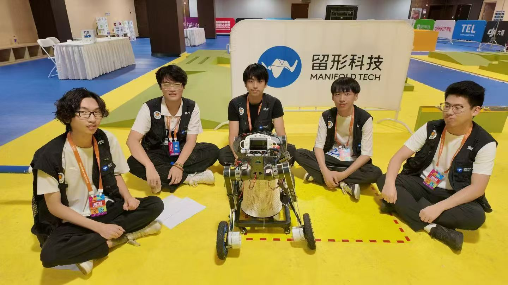
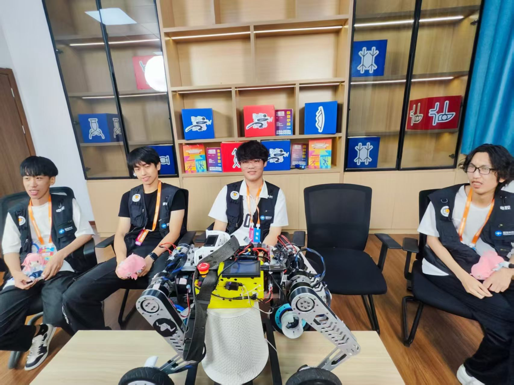

  <figure>
    
    <figcaption>Robocon 比赛会场</figcaption>
  </figure>
  <figure>
    
    <figcaption>团队合照</figcaption>
  </figure>
  <figure>
    
    <figcaption>团队合照（二）</figcaption>
  </figure>
  <figure>
    
    <figcaption>团队合照（三）</figcaption>
  </figure>
  <figure>
    
    <figcaption>机器人实物</figcaption>
  </figure>
  <figure>
    
    <figcaption>比赛现场</figcaption>
  </figure>
  <figure>
    
    <figcaption>比赛现场（二）</figcaption>
  </figure>
  <figure>
    
    <figcaption>留形采访记录</figcaption>
  </figure>
  <figure>
    
    <figcaption>组委会采访</figcaption>
  </figure>
  <figure>
    
    <figcaption>获奖记录</figcaption>
  </figure>
  <figure>
    
    <figcaption>获奖记录（二）</figcaption>
  </figure>

